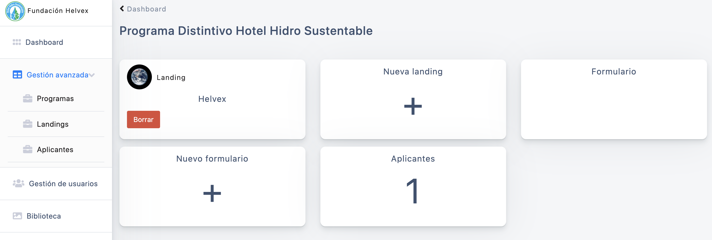

# helvex
Sistema para gestionar y crear landing page con registro.

## Instalación
El sistema se creo con [Laravel](https://laravel.com/) y cuenta con roles de usuario y dependiendo el rol accede a diferentes secciones de la administración del sistema ademas de almacenar contenido como pdf en un bucket de [AWS](https://aws.amazon.com/es/) para almacenar los documentos guardados en el registrado.

Página para acceder a la administración.

	

La landing page para el registro.

	

Panel de administración y diferentes secciones del sistema.

	
	
	
	
	
	

